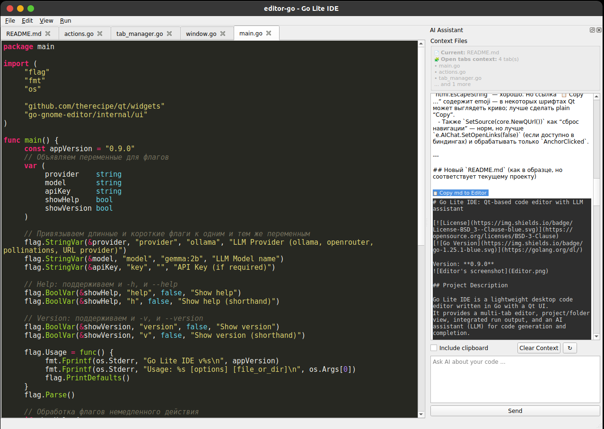

# Go Lite IDE: Qt-based code editor with LLM assistant

Version: **0.9.1**  

## Project Description

Go Lite IDE is a lightweight desktop code editor written in Go with a Qt UI.  
It provides a multi-tab editor, project/folder view, integrated run output, and an AI assistant (LLM) for code generation and completion.

## Key features

- Multi-tab editor with “Save / Save As”, unsaved changes protection.
- Open file or open project folder (project tree dock).
- Built-in “Run Go Code” with arguments and live output panel (stop process supported).
- AI Assistant dock:
  - Chat with LLM providers (Ollama / OpenRouter / Pollinations / custom URL provider).
  - Context controls: current file + optional project context files + optional clipboard.
  - Optional context from **all open tabs**.
  - Conversation history context (configurable size, clearable).
  - “Copy code block to editor” button from AI responses.
- AI inline features:
  - **Line completion** (Tab / Ctrl+Space) when enabled.
  - **Multi-line completion** (Ctrl+L) when enabled.
  - Comment-based code generation when cursor is on an empty line and there is a `// comment` above (via Ctrl+L).
- Basic editor productivity:
  - Find / Replace, Go to line, indent/unindent, toggle comment.
  - Optional line numbers, cursor style, color schemes.

## Installation
bash
git clone https://github.com/SkalaSkalolaz/editor-go.git
cd editor
go build -o editor

> Note: this project uses **therecipe/qt** bindings, so you need a working Qt setup compatible with your environment.

## Quick start

Run the editor: 
bash
./editor [options] [file_or_dir]
Examples:

- Open a file:
bash
./editor ./main.go

- Open a project folder:
bash
./editor ./my-project

- Use Ollama (default):
bash
./editor --provider ollama --model gemma:2b ./my-project

- Use OpenRouter with API key:
bash
./editor --provider openrouter --model deepseek/deepseek-chat-v3.1:free --key YOUR_KEY ./file.go

- Use a custom URL provider:
bash
./editor --provider https://your-llm-endpoint.example/v1/chat/completions --model your-model --key YOUR_KEY ./src

## Command line options

- `--provider` (default: `ollama`)  
  LLM Provider name: `ollama`, `openrouter`, `pollinations`, or any API URL provider
- `--model` (default: `gemma:2b`)  
  Model name for selected provider
- `--key`  
  API key (if required)
- `-h, --help`  
  Show help
- `-v, --version`  
  Show version

## Keyboard shortcuts

| Key             | Action                                                                             |
|-----------------|------------------------------------------------------------------------------------|
| Ctrl+N          | New file (new tab)                                                                 |
| Ctrl+O          | Open file                                                                          |
| Ctrl+Shift+O    | Open folder / project                                                              |
| Ctrl+S          | Save                                                                               |
| Ctrl+Shift+S    | Save As                                                                            |
| Ctrl+Q          | Quit                                                                               |
| Ctrl+F          | Find                                                                               |
| Ctrl+H          | Find & Replace                                                                     |
| F3              | Find next                                                                          |
| Shift+F3        | Find previous                                                                      |
| Ctrl+G          | Go to line                                                                         |
| Ctrl+/          | Toggle comment                                                                     |
| Ctrl+]          | Indent selection                                                                   |
| Ctrl+[          | Unindent selection                                                                 |
| Ctrl+R          | Run Go code                                                                        |
| Escape          | Close search / reject AI suggestion / clear bracket highlight (priority-based)     |
| Ctrl+Space      | AI line completion (when enabled)                                                  |
| Tab             | AI line completion (when enabled; otherwise inserts tab / indents selection)       |
| Ctrl+L          | AI multi-line completion / comment-based generation (when enabled)                 |
| Ctrl+Shift+L    | Open AI Assistant dock                                                             |

## AI Assistant context notes

The AI prompt may include:
- Recent chat history (configurable in **View → AI History Settings**)
- Current file content
- Optional: all open tabs content
- Optional: selected project context files
- Optional: clipboard content

Use **Clear Context** in the AI panel to reset optional context and chat history.

## License

This project is distributed under the **BSD-3-Clause** license.  
See `LICENSE.txt` for details.

## Contributing

PRs and issues are welcome.
- OS / Qt version
- Go version
- Steps to reproduce (for bugs)
